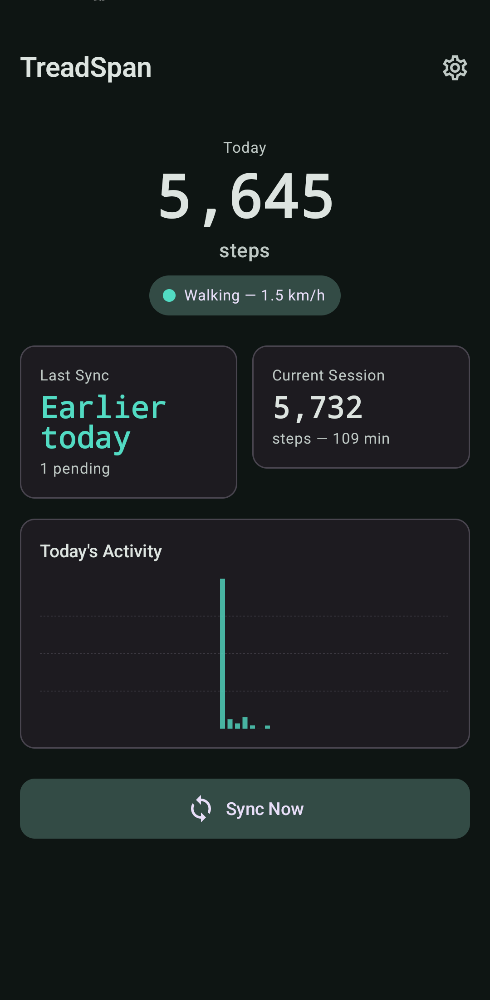
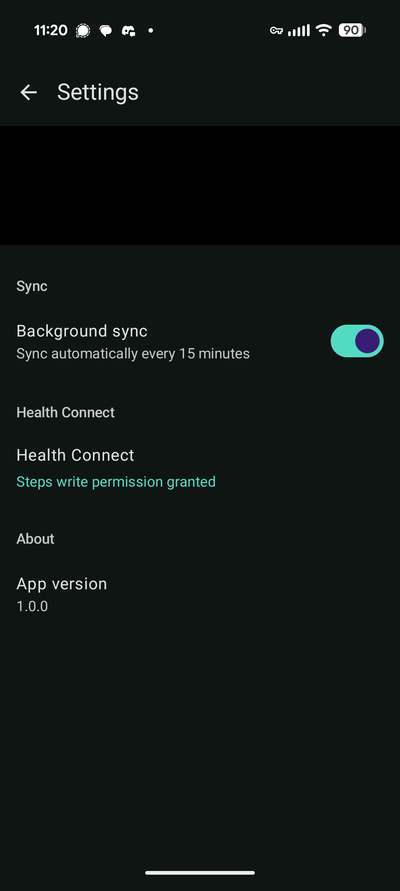

# TreadSpan

Track steps from a Sperax RM01 under-desk treadmill and sync them to Google Health Connect.

TreadSpan is a two-part system: a **Linux service** that connects to the treadmill via Bluetooth Low Energy and records step data, and an **Android companion app** that syncs those steps to Health Connect so they show up in Google Fit.

<p align="center">
  
  &nbsp;&nbsp;&nbsp;
  
</p>

## How it works

```
Sperax RM01 ──BLE──> Linux Service ──HTTPS──> Android App ──> Health Connect
               (F5/FA protocol)     (SQLite)    (polling)       (StepsRecord)
```

1. The **Linux service** connects to the treadmill's BLE module (wi-linktech WLT6200), performs a proprietary handshake, and polls for step/speed/distance data every 30 seconds
2. Readings are stored in **SQLite** with session detection and delta computation. Steps are aggregated into 5-minute intervals
3. The service exposes a small **HTTPS API** for the Android app to consume
4. The **Android app** periodically fetches pending intervals and writes them as `StepsRecord` entries to Health Connect
5. Steps appear in **Google Fit** and any other app that reads from Health Connect

## Features

- **Resilient BLE connection**: 6-state state machine with exponential backoff and automatic Bluetooth adapter power-cycle recovery
- **No lost steps**: The treadmill reports cumulative steps per session. If the BLE connection drops, the next successful read captures the full delta
- **Durable storage**: Every reading is persisted to SQLite (WAL mode) immediately. Pending sync intervals survive service restarts
- **Idempotent sync**: Health Connect writes use `clientRecordId` for deduplication. Crashes mid-sync won't create duplicate step entries
- **Background sync**: Android WorkManager syncs every 15 minutes without the app being open
- **Session detection**: Automatically detects treadmill power cycles (step counter resets) and service restarts without double-counting

## Supported hardware

- **Sperax RM01** (and likely other Sperax models using the wi-linktech WLT6200 BLE module)
- The BLE protocol uses F5/FA framing with F0 byte-stuffing. Other treadmills with this module may work

## Setup

### Linux service

Requires Python 3.12+ and a Bluetooth adapter.

```bash
# Install dependencies
pip install bleak aiohttp

# Clone the repo
git clone https://github.com/tfournet/treadmill.git
cd treadmill

# Run directly (for testing)
python -m treadmill_service

# Or install as a systemd user service
cp treadmill-monitor.service ~/.config/systemd/user/
systemctl --user daemon-reload
systemctl --user enable --now treadmill-monitor

# Follow the logs
journalctl --user -u treadmill-monitor -f
```

### Configuration

Create `~/.config/treadmill/config.toml`:

```toml
[ble]
device_name = "SPERAX_RM01"  # BLE advertisement name
poll_interval_secs = 30

[db]
path = "~/.local/share/treadmill/treadmill.db"

[api]
port = 34150
tls_cert = "~/.config/treadmill/tls.crt"
tls_key = "~/.config/treadmill/tls.key"

[intervals]
aggregate_every_secs = 300  # 5 minutes
```

### HTTPS with Tailscale (recommended)

If your Linux machine and phone are on the same Tailscale network:

```bash
# Generate TLS certs
sudo tailscale cert \
  --cert-file ~/.config/treadmill/tls.crt \
  --key-file ~/.config/treadmill/tls.key \
  your-machine.tailnet-name.ts.net

# Fix key permissions
sudo chown $USER ~/.config/treadmill/tls.key

# Open the port
sudo firewall-cmd --add-port=34150/tcp --permanent
sudo firewall-cmd --reload
```

### Android app

1. Open the `android/` directory in Android Studio
2. Build and install on your phone
3. On first launch, enter your server address (e.g., `your-machine.tailnet-name.ts.net:34150`)
4. Tap **Health Connect > Tap to grant permission** and allow Steps read/write
5. Steps sync automatically every 15 minutes, or tap **Sync Now**

## API endpoints

| Method | Path | Description |
|--------|------|-------------|
| `GET` | `/api/status` | BLE connection state, active session, last reading |
| `GET` | `/api/intervals/pending` | Unsynced step intervals |
| `GET` | `/api/intervals/today` | All intervals for today (synced + pending) |
| `POST` | `/api/intervals/{id}/synced` | Mark an interval as synced |

## BLE protocol

The Sperax RM01 uses a proprietary protocol over BLE service `0xFFF0`:

- **Notify characteristic** `0xFFF1`: receives data frames
- **Write characteristic** `0xFFF2`: sends commands
- **Frame format**: `[F5] [LEN] [PAYLOAD...] [CRC_HI] [CRC_LO] [FA]`
- **Byte stuffing**: real bytes `F0/F5/FA` are escaped as `[F0] [byte ^ F0]`
- **Handshake**: send `CMD_INIT_1` twice, then `CMD_INIT_2`, before data flows
- **Polling**: send `CMD_POLL`, receive 24-byte response with steps, speed, time, distance

See [`treadmill_service/protocol.py`](treadmill_service/protocol.py) for the full decoder.

## Architecture

```
treadmill_service/
  protocol.py    # BLE frame decoder (F5/FA framing, byte unstuffing)
  ble.py         # 6-state connection state machine with adapter recovery
  collector.py   # Session detection, delta computation, interval aggregation
  db.py          # SQLite schema and CRUD (WAL mode)
  api.py         # HTTPS API (aiohttp)
  config.py      # TOML configuration
  __main__.py    # Entry point (asyncio TaskGroup)

android/app/src/main/java/com/tfournet/treadmill/
  data/          # API client, Health Connect manager
  sync/          # WorkManager periodic sync
  ui/            # Jetpack Compose UI (Material 3, teal theme)
```

## License

[MIT](LICENSE)
